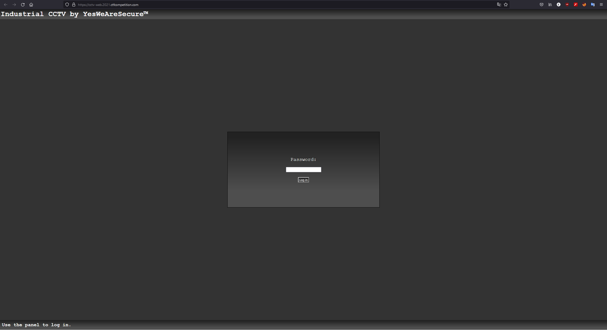
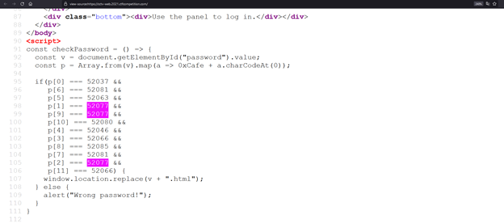
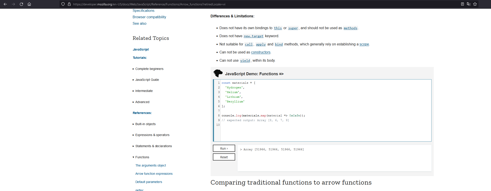
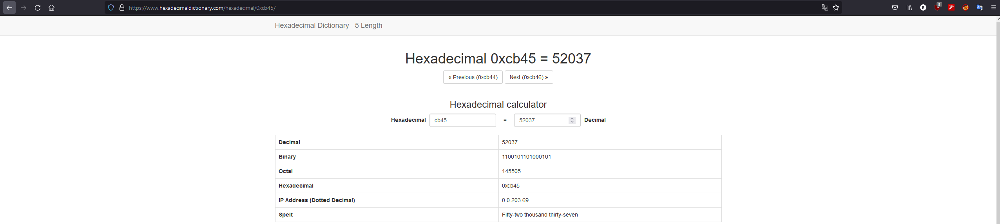
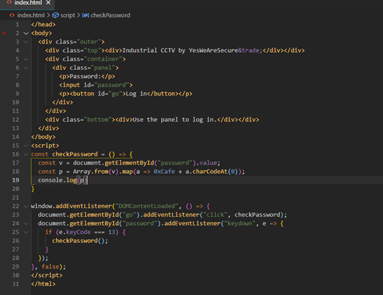
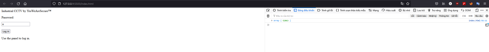
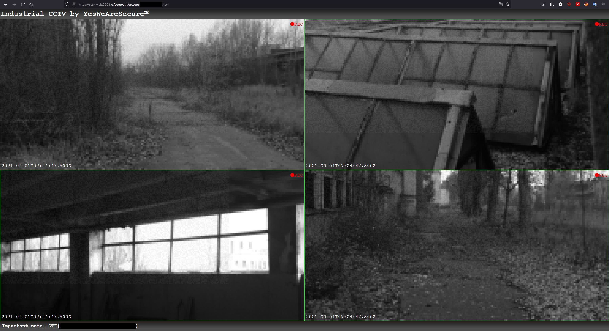

<h1>Stage 1: CHEMICAL PLANT - CCTV (REV)</h1>

<h2> Welcome to GoogleCTF write-up </h2>

First stage link: https://cctv-web.2021.ctfcompetition.com



First thing that I want to check is <a href=view-source:https://cctv-web.2021.ctfcompetition.com>source code </a>



There is `a.charCodeAt(0)` in source code but append does not work in arrow func.

emo::ji("poop")
`
So the password only have 12 characters and, it redirect to <password>.html
`

Password sorting:

```
p[0] === 52037
p[1] === 52077
p[2] === 52077
p[3] === 52066
p[4] === 52046
p[5] === 52063
p[6] === 52081
p[7] === 52081
p[8] === 52085
p[9] === 52077
p[10] === 52080
p[11] === 52066
```

There is an expression that I do not know how to use it. So i searching <a href=https://developer.mozilla.org/en-US/docs/Web/JavaScript/Reference/Functions/Arrow_functions>"arrow func" </a> and test the 0xCafe what does it mean.

As a description: `"An arrow function expression is a compact alternative to a traditional function expression, but is limited and can't be used in all situations."`

The page have an example for this func.



One more thing, there are some number that in the array the number `52037` 



I test the `checkPassword` function with `localhost`



This quite similar to `ASCII`



`
Gotcha!
`



Woohoo!


